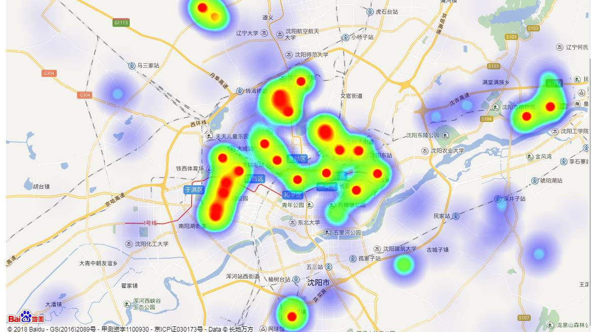

#沈阳医保项目
## 热力图

沈阳医保家庭医生项目当中， 居民与医院建立签约服务关系。 根据居民预留的地址， 集成百度地图的heatmap组件， 生成签约居民分布热力图。 

其目的在于在常规的统计当中， 只能以柱状图， 饼图， 条形图进行数据展示。 以地图的形式进行显示， 可以让统计人员， 领导， 更加直观的发现签约工作的进行情况。 根据地图上的居民热力情况和医院的地址信息， 更好的了解家庭医生的推广行为

## 实现

